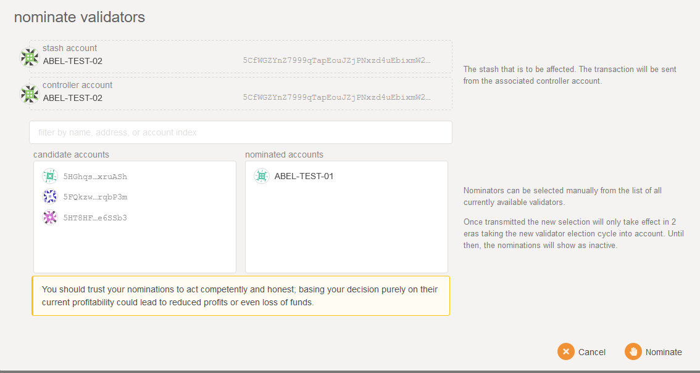

# How to Nominate

## Create Your Account On Testnet UI. 

> NOTE: Use Firefox to do the following. 

Main region: [Testnet UI](http://testnet.abel.beer). 
Asian-Pacific region: [Testnet UI](http://121.196.109.253)

First, we need set Firefox's config. Type `abount:config` in the address bar, 
search `network.websocket.allowInsecureFromHTTPS` and change it's value to `true`.

On the "Accounts" tab, click "Add account". You do not need to provide a name, although you may if you would like to save this account for submitting transaction in addition to validating.

Generate an sr25519 key which will be used by Aura for block production. Take careful note of the menmonic phrase, and the SS58 address which can be copied by clicking on the identicon in the top left.

Then generate an ed25519 key which will be used by GRANDPA for block finalization. Again, note the menmonic phrase and ss58 address.

## Bond Abel Token
It is highly recommended that you make your controller and stash accounts be two separate accounts. For this, you will create two accounts and make sure each of them have at least enough funds to pay the fees for making transactions. Keep most of your funds in the stash account since it is meant to be the custodian of your staking funds.

Make sure not to bond all your ABEL balance since you will be unable to pay transaction fees from your bonded balance.

It is now time to set up our validator. We will do the following:
- Bond the ABEL of the Stash account. These ABEL will be put at stake for the security of the network and can be slashed.
- Select the Controller. This is the account that will decide when to start or stop validating.

First, go to the Staking section. Click on "Account Actions", and then the "Stash" button.

- Stash account - Select your Stash account. In this example, we will bond 50 ABEL - make sure that your Stash account contains at least this much. You can, of course, stake more than this.
- Controller account - Select the Controller account created earlier. This account will also need a small amount of ABEL in order to start and stop validating.
Value bonded - How much ABEL from the Stash account you want to bond/stake. Note that you do not need to bond all of the ABEL in that account. Also note that you can always bond more ABEL later. However, withdrawing any bonded amount requires the duration of the unbonding period.
- Payment destination - The account where the rewards from validating are sent.

Once everything is filled in properly, click Bond and sign the transaction with your Stash account.

## Nominate a validator
Pick "Account actions", then click the "+ Nominator" button.

You will see a modal window that looks like the below:

You are now bonded. Being bonded means your tokens are locked and could be slashed if the validators you nominate misbehave. All bonded funds can now be distributed to up to 16 validators. Be careful about the validators you choose since you will be slashed if your validator commits an offence.

Click on "Nominate" on an account you've bonded and you will be presented with another popup asking you to select up to 16 validators. Although you may choose up to 16 validators, due to the Phragmén election algorithm your stake may be dispersed in different proportions to any subset or all of the validators your choose.

Select them, confirm the transaction, and you're done - you are now nominating. Your nominations will become active in the next era. Eras last twenty-four hours on Abel-bkChain - depending on when you do this, your nominations may become active almost immediately, or you may have to wait almost the entire twenty-four hours before your nominations are active.

Assuming at least one of your nominations ends up in the active validator set, you will start to get rewards allocated to you. In order to claim them (i.e., add them to your account), you must manually claim them.

## Stop nominating
At some point, you might decide to stop nominating one or more validators. You can always change who you're nominating, but you cannot withdraw your tokens unless you unbond them. 

